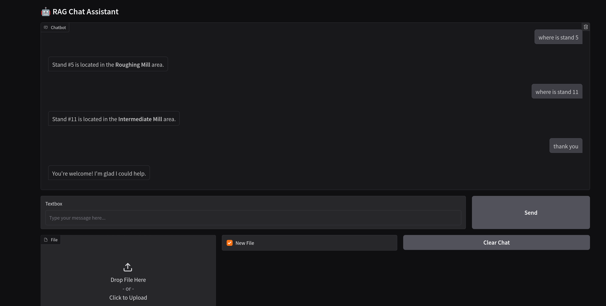

# Naive RAG Compose

## Services:

- **embedding**:
  - embeds using `nomic-ai/nomic-embed-text-v1.5` model: long context, uses `clustering:` and `search_query:` prefixes for better retrieval.
  - uses FAISS db with local saving with docker volume
  - RAG search with FAISS index.search, default k=5

- **ingestion**:
  - file upload for text and markdown

- **query**:
  - query database with `embedding` service

- **llm**:
  - uses openrouter models (here: gemma3n) using openAI library for consistency.
  - add your API key while using in `./llm-service/.env`
  - streaming support
  - gradio UI support
  - file upload for RAG from frontend

## To run:

- huggingface embedding model setup
  
    ```bash
    python3 -m venv .venv
    source ./.venv/bin/activate
    pip install transformers einops httpx
    mkdir ./embedding-service/model_weights
    ```

    ```py
    from transformers import AutoModel, AutoTokenizer
    tokenizer = AutoTokenizer.from_pretrained('bert-base-uncased',cache_dir='./embedding-service/model_weights')
    model = AutoModel.from_pretrained('nomic-ai/nomic-embed-text-v1.5', trust_remote_code=True, safe_serialization=True,cache_dir='./embedding-service/model_weights')
    ```

- docker compose
    ```
    sudo docker compose up --build
    ```

- pip requirements and env vars for each service are in their respective dirs. 

- frontend UI will be accessible at `http://localhost:8004/`

- basic tests included in ./tests dir to check upload and query endpoints

# UI

